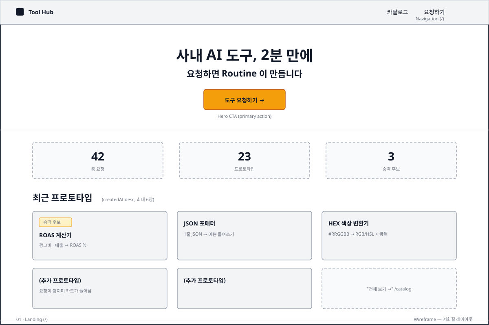
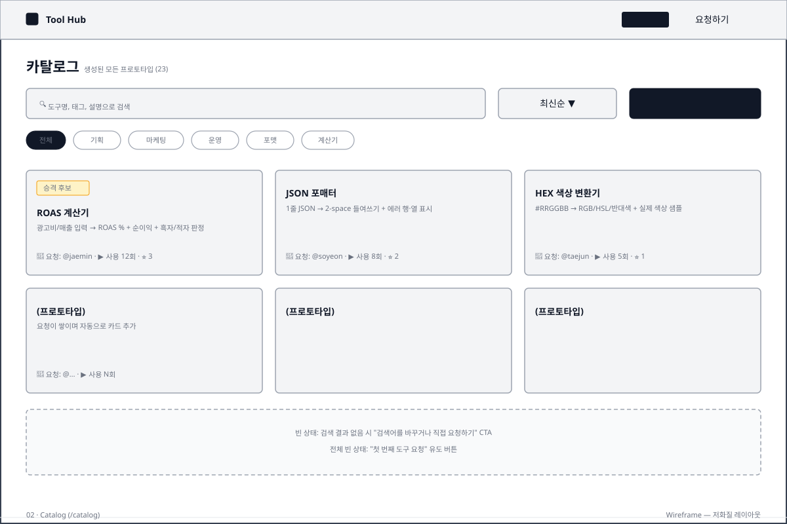
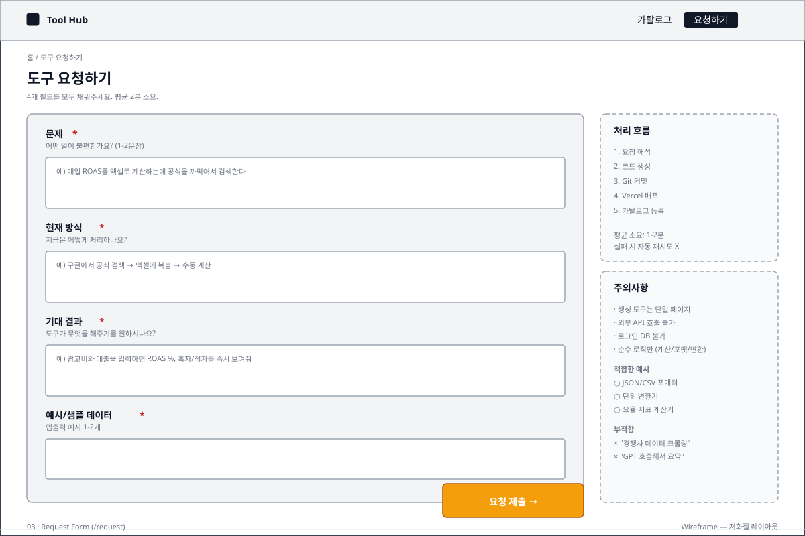
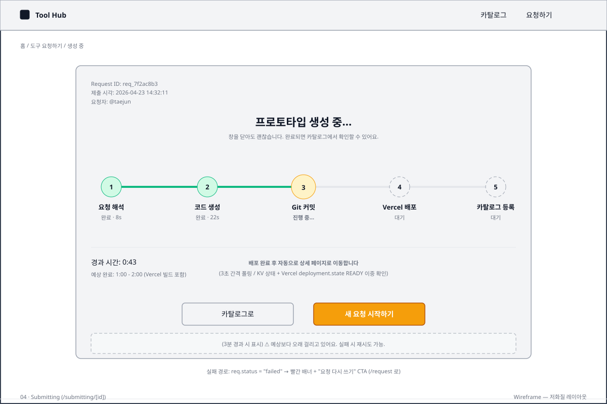
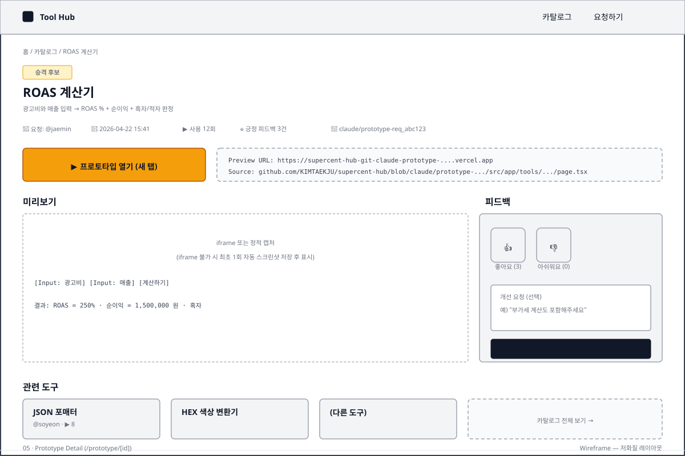

# AI Tool Request Hub — 화면 설계

과제 제출물 §⑦ 에서 참조하는 화면 설계 자료 묶음.

## 구성

| 구분 | 파일 | 용도 |
|---|---|---|
| 와이어프레임 1 | [01-landing.svg](01-landing.svg) | 랜딩 페이지 (`/`) |
| 와이어프레임 2 | [02-catalog.svg](02-catalog.svg) | 카탈로그 (`/catalog`) |
| 와이어프레임 3 | [03-request.svg](03-request.svg) | 요청 폼 (`/request`) |
| 와이어프레임 4 | [04-submitting.svg](04-submitting.svg) | 제출 대기 (`/submitting/[id]`) |
| 와이어프레임 5 | [05-prototype-detail.svg](05-prototype-detail.svg) | 프로토타입 상세 (`/prototype/[id]`) |
| 사용자 플로우 | [user-flow.md](user-flow.md) | 5개 화면 간 전체 이동 경로 (Mermaid) |

> 와이어프레임은 각 화면 **레이아웃 의도**를 증명합니다. 플로우 다이어그램은 화면 간 **상태 전이·병렬 호출**을 증명합니다. 둘은 겹치지 않습니다.

---

## 01 · Landing (`/`)

**핵심 구성**
- 상단 헤더 (로고 + 카탈로그/요청하기 네비)
- 히어로 CTA ("도구 요청하기") — 요청 동선의 단일 진입점
- 카운터 3종 (총 요청 / 프로토타입 / 승격 후보)
- 최근 프로토타입 카드 그리드 (createdAt desc, 최대 6장)

**설계 근거**: 비개발 구성원이 3초 안에 "여기서 요청하면 된다"를 인지해야 함. CTA 1개·암버 1색만.

---

## 02 · Catalog (`/catalog`)

**핵심 구성**
- 검색 + 정렬 (최신순/사용순) + 새 요청 CTA
- 태그 칩 필터 (전체/기획/마케팅/운영/포맷/계산기)
- 카드 3열 × 2행 그리드 (승격 후보 배지 amber-500)
- 빈 상태 2종 (검색 미일치, 전체 비어있음)

**설계 근거**: AI Ops 가 큐레이션 시 "승격 후보만 보고 싶다"는 수요를 배지 필터로 해결. 검색은 제목·태그·설명 전부 매칭.

---

## 03 · Request Form (`/request`)

**핵심 구성**
- 4필드 강제 (problem / currentWay / expectedOutcome / examples)
- 각 필드에 placeholder 예시 — Routine 파싱 실패 방지
- 사이드바: 처리 흐름 안내 + 적합/부적합 예시 — **생성 실패 사전 차단**
- 하단 제출 버튼 (amber-500)

**설계 근거**: 자유 텍스트 입력은 Routine 파싱 품질을 떨어뜨림. 4필드로 구조 강제 + 부적합 예시 명시로 "AI 호출 도구" 같은 잘못된 요청을 사용자 단에서 걸러냄.

---

## 04 · Submitting (`/submitting/[id]`)

**핵심 구성**
- 5단계 진행률 바 (해석 → 생성 → 커밋 → 배포 → 등록)
- 현재 단계 amber 하이라이트, 완료 단계 emerald
- 경과 시간 + 예상 완료 시간
- 3분 경과 시 타임아웃 경고 배너 (optional)
- 실패 경로: 빨간 배너 + "요청 다시 쓰기" CTA

**설계 근거**: Routine 은 fire-and-forget 이라 Hub 가 KV 를 3초 간격 폴링. **KV ready + Vercel deployment.state=READY 이중 확인** 후에만 상세로 이동 — 심사자가 "열기" 클릭 시점에 반드시 접근 가능해야 함.

---

## 05 · Prototype Detail (`/prototype/[id]`)

**핵심 구성**
- 헤더: 제목 · 승격 배지 · 사용 횟수 · Git 브랜치
- "프로토타입 열기" 대형 CTA (새 탭) — 주요 전환 포인트
- 미리보기 영역 (iframe 또는 최초 1회 스크린샷)
- 우측 피드백 패널 (👍/👎 + 개선 요청 textarea → `refine-prototype` 트리거)
- 하단 관련 도구 3장 + 카탈로그 복귀

**설계 근거**: 피드백을 상세 페이지에 두어 **사용 직후 수집**. 개선 요청 텍스트는 곧바로 `refine-prototype` Routine 입력 JSON 이 됨 — 추가 파싱 불필요.

---

## 와이어프레임 수준에 대한 주석

이 와이어프레임은 의도적으로 **저화질 박스 레이아웃**입니다:

- 디자인 시안이 아니라 **레이아웃·컴포넌트 배치 의도**를 증명
- 최종 UI 는 [라이브 URL](https://supercent-hub.vercel.app) 및 [데모 GIF](../demo/hub-demo.gif) 로 별도 증명
- 하드코딩 수치(1200×800)는 사내 데스크톱 가정. 모바일 대응은 본 MVP 스코프 외

---

## 관련 자료

- [`docs/wireframes/user-flow.md`](user-flow.md) — 전체 사용자 플로우 (Mermaid)
- [`docs/demo/hub-demo.gif`](../demo/hub-demo.gif) — 실제 동작 GIF (예정)
- [라이브 URL](https://supercent-hub.vercel.app) — 배포된 Hub
