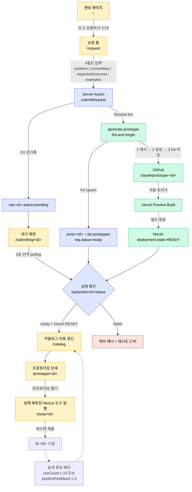

# AI Tool Request Hub — User Flow

요청 제출부터 자동 생성·배포된 프로토타입 실행까지의 사용자 여정.

## 범례

- 🟡 **사용자 여정** — 브라우저에서 실제로 방문하는 화면
- 🟣 **Hub 서버 로직** — Next.js Server Action + API Route + KV 조작
- 🟢 **외부 인프라** — Claude Code Routine · GitHub REST · Vercel Deployment
- 🔴 **실패 경로** — 터미널 상태

## 핵심 결정 포인트

1. **KV 선기록 → fire-and-forget**: Routine 응답을 기다리지 않고 즉시 대기 화면 렌더
2. **이중 완료 조건**: KV `ready` + Vercel `deployment.state=READY` 둘 다 확인해야 "열기" 가능 (30-60초 빌드 갭 커버)
3. **점선 루프**: 피드백 누적이 임계 넘으면 카탈로그의 카드에 "승격 후보" 배지로 반영 (비동기 집계)
